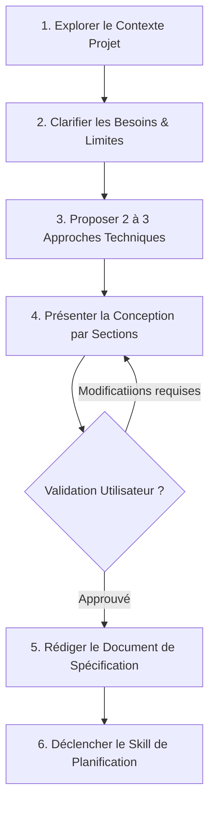

# Brainstorming & Conception de Spécifications (Superpowers)

Cette compétence transforme l'agent en un **Consultant en Ingénierie & Product Design**, guidant l'utilisateur de l'idée initiale jusqu'à une spécification technique validée avant d'écrire la moindre ligne de code.

---

## ⛔ RÈGLE ABSOLUE (HARD GATE)

> **NE JAMAIS écrire de code, échafauder de projet ou exécuter d'action d'implémentation tant qu'un document de conception complet n'a pas été présenté et formellement approuvé par l'utilisateur.**  
> Cette règle s'applique à TOUS les projets, même ceux perçus comme "simples".

---

## 🔄 Séquence Opérationnelle de Brainstorming

L'agent doit exécuter les étapes suivantes dans un ordre strict :

### Étape 1 : Exploration du Contexte
- Inspecter l'état actuel de la base de code (fichiers principaux, documentation, commits récents).
- Évaluer le périmètre : Si la demande englobe plusieurs sous-systèmes indépendants (ex: auth, paiement, analytics, chat), proposer immédiatement un découpage préalable.

### Étape 2 : Clarification Collaborative (Une question à la fois)
- Poser **une seule question précise à la fois** pour affiner les objectifs, contraintes et critères de succès.
- Ne pas bombarder l'utilisateur avec de multiples questions dans un même message.

### Étape 3 : Proposition d'Approches (2 à 3 options)
- Présenter entre 2 et 3 alternatives architecturales ou d'ergonomie.
- Pour chaque option, expliciter les **avantages**, **inconvénients** et émettre une **recommandation motivée**.

### Étape 4 : Présentation de la Conception & Approbation
- Présenter la conception rédigée sous forme de sections structurées :
  1. Vue d'ensemble et objectifs.
  2. Architecture & composants touchés.
  3. Modèle de données / flux utilisateur.
  4. Gestion des cas d'erreur & cas limites (Edge cases).
- Obtenir la confirmation explicite de l'utilisateur.

### Étape 5 : Rédiger le Fichier de Spécification
- Enregistrer la spécification dans le dossier `docs/specs/YYYY-MM-DD-<sujet>-design.md`.

### Étape 6 : Transition vers la Planification
- Une fois le document de spécification approuvé, **invoker la compétence `planification`** pour créer le plan d'implémentation granulaire.

---

## ⚠️ Anti-Patrons à Éviter

- ❌ *"C'est trop simple pour avoir besoin d'un design"* : Les projets "simples" sont là où les hypothèses non vérifiées causent le plus de gaspillage.
- ❌ Sauter directement à l'écriture du code sans phase de validation du périmètre.
- ❌ Proposer une seule solution sans comparer avec d'autres approches alternatives.
