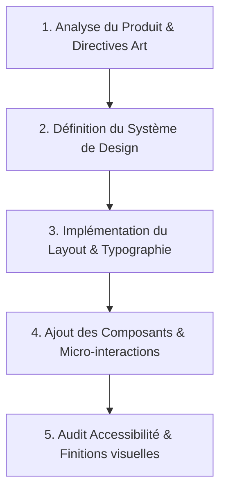

# UI/UX Pro Max - Compétence Avancée de Design & Accessibilité

Cette compétence transforme l'agent en un **Architecte Lead UI/UX** autonome, capable de créer des interfaces d'exception, modernes, cohérentes et totalement accessibles selon les standards industriels les plus exigeants.

---

## 🎯 Objectifs Majeurs

1. **Effet « WOW » Visuel** : Éviter les designs génériques ou "MVP minimalistes". Utiliser des palettes Tailored HSL, une typographie moderne (Google Fonts), des dégradés subtils et des micro-animations dynamiques.
2. **Accessibilité Sans Concession (WCAG 2.1 AA/AAA)** : Ratio de contraste minimal de 4.5:1 pour le texte normal, cibles tactiles >= 44x44px, indicateurs de focus visibles et navigation clavier.
3. **Directives Système de Design** : Normaliser la typographie, les espaces (système 8pt), les rayons de bordure (border-radius), et la hiérarchie visuelle.
4. **Ergonomie & Micro-interactions** : Retour visuel immédiat sur chaque action utilisateur (états `:hover`, `:active`, `:focus-visible`, `:disabled`, chargements et squelettes).

---

## 🔄 Workflow Séquentiel de Conception UI/UX

Lors de la création ou de la refonte d'un composant ou d'une page web, appliquer l'ordre logique suivant :



### Étape 1 : Direction Artistique & Palette HSL
- **Ne jamais utiliser de couleurs brutes de navigateur** (`red`, `blue`, `#000000`).
- Construire une palette harmonieuse basée sur HSL avec variables CSS :
  - `--primary` : Couleur d'action principale.
  - `--surface` / `--background` : Fond principal et secondaire (mode sombre ou clair sophistiqué).
  - `--text-main` / `--text-muted` : Hiérarchie typographique claire.
  - `--accent` : Couleur d'accentuation (notifications, badges, effets d'over).

### Étape 2 : Layout, Typographie & Espacement (System 8pt)
- Charger des polices modernes (ex: *Inter*, *Plus Jakarta Sans*, *Outfit* via Google Fonts).
- Utiliser un système de grille fluide (CSS Grid / Flexbox) et des conteneurs responsifs.
- Appliquer la règle des 8px pour les marges et paddings (`8px`, `16px`, `24px`, `32px`, `48px`).

### Étape 3 : Micro-animations & Rétroaction Visuelle
- Tout élément interactif (bouton, carte, lien, input) doit posséder une transition fluide (`transition: all 0.2s cubic-bezier(0.4, 0, 0.2, 1)`).
- Intégrer un effet d'élévation au survol (ex: `transform: translateY(-2px)` + ombre portée dynamique).

### Étape 4 : Audit d'Accessibilité (WCAG)
- Vérifier que chaque bouton ou icône cliquable possède un aria-label explicite s'il n'y a pas de texte.
- S'assurer que le focus n'est pas supprimé sans être remplacé par un anneau de focus sur-mesure (`:focus-visible`).

---

## 🎨 Styles Visuels Tendances Prêts à l'Emploi

### 1. Glassmorphism Sombre Premium (Glass Effect)
```css
.glass-card {
  background: rgba(255, 255, 255, 0.05);
  backdrop-filter: blur(16px) saturate(180%);
  -webkit-backdrop-filter: blur(16px) saturate(180%);
  border: 1px solid rgba(255, 255, 255, 0.125);
  border-radius: 16px;
  box-shadow: 0 8px 32px 0 rgba(0, 0, 0, 0.37);
}
```

### 2. Bouton Principal Interactif avec Dégradé et Effet Glow
```css
.btn-primary {
  background: linear-gradient(135deg, hsl(220, 90%, 56%), hsl(260, 85%, 62%));
  color: #ffffff;
  font-weight: 600;
  padding: 12px 24px;
  border-radius: 12px;
  border: none;
  cursor: pointer;
  transition: transform 0.2s ease, box-shadow 0.2s ease;
  box-shadow: 0 4px 14px 0 rgba(99, 102, 241, 0.39);
}

.btn-primary:hover {
  transform: translateY(-2px);
  box-shadow: 0 6px 20px 0 rgba(99, 102, 241, 0.54);
}

.btn-primary:focus-visible {
  outline: 3px solid hsl(220, 90%, 75%);
  outline-offset: 2px;
}
```

---

## ⚠️ Règles et Contraintes Inviolables

1. **Interdiction des Placeholders Génériques** : Ne jamais insérer d'images cassées ou de textes "Lorem Ipsum" si des éléments réels ou générés via les outils peuvent être produits.
2. **Pas de Boutons ou Liens sans Rétroaction** : Toujours fournir un état `:hover`, `:active` et `:focus-visible`.
3. **Contraste de Texte Élevé** : Toujours tester la lisibilité du texte secondaire (`--text-muted`).
4. **Mobile First & Touch Targets** : Les éléments cliquables doivent mesurer au moins 44px de hauteur/largeur sur écran tactile.
5. **Composants Cohérents** : Reutiliser les variables CSS définies au niveau de `:root` pour préserver une identité visuelle unifiée sur tout le site.
